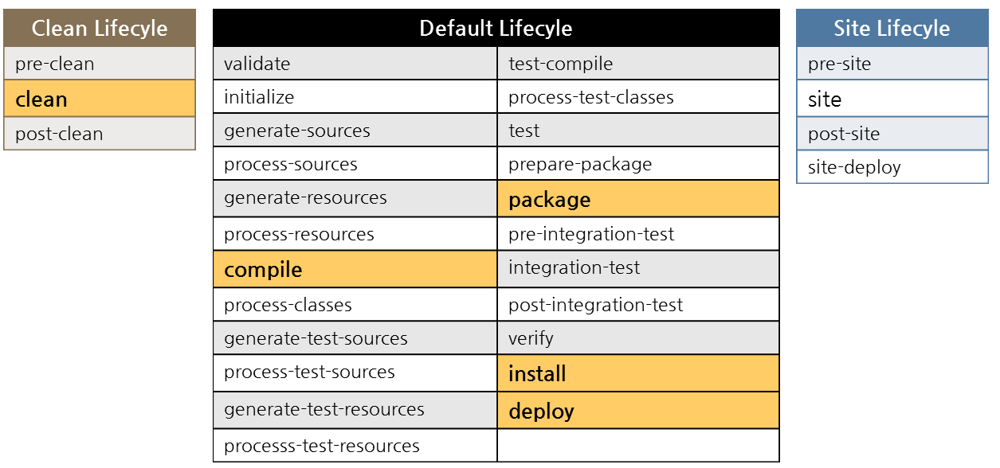

# Maven
> 아파치 소프트웨어 재단에서 개발하는 Java 기반 프로젝트의 라이프사이클 관리를 위한 빌드 도구. 이에 따라 컴파일과 빌드를 동시에 수행, 테스트를 병행하거나 서버 측 Deploy 자원을 관리할 수 있는 환경을 제공한다. 또한 라이브러리 관리 기능도 내포하고 있다. Java로 개발하다 보면 다양한 라이브러리를 필요로 하게 되는데, settings.xml 또는 pom.xml 파일에 필요한 라이브러리만 적으면 Maven이 알아서 다운받고 설치해주고 경로까지 지정해준다.  

## 장점 vs 단점
장점|단점
-----|-----
컴파일과 빌드를 동시에 수행할 수 있다.|Maven에서 기본적으로 지원하지 않는 빌드 과정을 추가해야 하는 경우 상당한 고생이 따른다.
서버의 Deploy 자원을 관리할 수 있는 환경을 제공한다.|특정 플러그인이 설정이 약간만 달라도 해당 설정을 분리해서 중복 기술할 때가 발생한다. 불필요하게 설정이 길어지고 중복, 가독성 저하가 발생하여 유지보수성을 떨어뜨린다.
pom.xml 파일을 통해 관리하므로 개발, 유지보수 측면에서 오픈소스 라이브러리, 프로젝트 등 관리가 용이하다.|이와 같은 단점을 해결하기 위해, Gradle(그레이들)이라는 새로운 빌드 툴이 등장하였다. Gradle은 안드로이드 애플리케이션의 기본 빌드 툴로 채택되었다.
IDE에 종속된 부분들을 제거할 수 있다.|-
Maven Profile 기능을 통해 배포 설정 파일을 관리하고 배포 파일을 생성할 수 있다.|-

## 프로젝트 구조


## 프로젝트 생성
```
mvn archetype:generate
```

1. groupId:  groupId uniquely identifies your project across all projects. 모든 프로젝트 사이에서 고유하게 식별해주는 것.  ex)org.apache.maven   
2. artifactId : artifactId is the name of the jar without version. artifactId는 버전 정보를 생략한 jar 파일의 이름이다.
3. version : 버젼!

## Maven Life Cycle
  
> maven은 clean, default, site 3가지의 life cycle을 가진다.  

1. clean : 빌드시 생성되었던 산출물 삭제
2. default : 프로젝트 배포절차, 패키지 타입별로 다르게 정의됌.
3. site : 프로젝트 문서화 절차

### clean

1. clean :  attempts to clean a project's working directory of the files that we're generated at build-time .
- build-time에 생성된 프로젝트의 디렉토리 혹은 파일을 삭제하는것을 시도한다.
