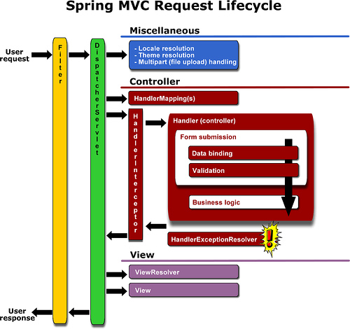

# Secure Coding (Java)

## SQL Injection
> SQL Injection 은 사용자가 입력한 데이터를 검증하지 않은 채로 쿼리문의 일부로 활용할 때 발생 할수 있는 취약점이다.   
> 이러한 취약점으로 인하여 데이터가 무단으로 조회되거나 인증과정이 부적절하게 수행되는 등의 문제점이 발생할 수 있다.

### 조치.

1. Filter로 검증한다.
2. Interceptor로 검증한다.
3. 라이브러리나 Validator로 검증한다.
4. Mybatis 쿼리문에서 #{}을 사용할 경우 JDBC PreparedStatement를 사용하게 되므로 쿼리문의 구조가 변경되지 않는다.   
    -${}을 사용할 경우 매개변수 값을 문자열 연결 방식으로 취환하므로 쿼리문의 구조가 변경 될수 있음.  
    1. statement: Statement 인터페이스는 CREATE , ALTER , DROP 등과 같은 DDL 문에 사용됩니다 . 이 인터페이스를 사용하여 런타임에 매개 변수를 SQL 쿼리에 전달할 수 없습니다.  
    2. PreparedStatement: 동적 또는 매개 변수화 된 SQL 쿼리를 실행하는 데 사용됩니다. 이 인터페이스를 사용하여 런타임에 SQL 쿼리에 매개 변수를 전달할 수 있습니다. 특정 SQL 쿼리를 여러 번 실행하는 경우 PreparedStatement를 사용하는 것이 좋습니다.   
    PreparedStatement가 사전 컴파일되고 쿼리 계획을 생성하는 횟수와 관계없이 쿼리 계획이 한 번만 만들어지기 때문입니다. 이렇게하면 많은 시간을 절약 할 수 있습니다.
    3.CallableStatement: 저장 프로 시저를 실행하는 데 사용됩니다.
    [참고 사이트](https://javaconceptoftheday.com/statement-vs-preparedstatement-vs-callablestatement-in-java/)

## Cross Site Script 
> 크로스 사이트 스크립팅은 외부 입력값을 충분히 검증하지 않고 응답의 일부로 사용할 때 발생할 수 있는 취약점 이다.  
> 주로 웹 어플리케이션에서 발생하는 취약점이다.  
>  와같은 입력값을 검증하지 않고 출력할 경우.

### 조치 
1. CSRF Token 사용 - 해당 요청이 사용자의 정상적인 요청인지를 구분하기 위해 세션별로 CSRF토큰을 생성하여 세션에 저장한다. 
    * Interceptor에서 토큰검사를 한다.
    * 비밀번호 변경과 같은 스크립트를 심어서 공격할수있는데 타사이트로 정보를 넘기는 경우는?? 왓더?
2. 라이브러리 사용 : lucy-xss [참고 사이트](https://github.com/naver/lucy-xss-servlet-filter)