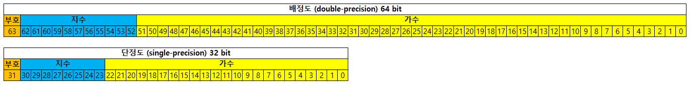
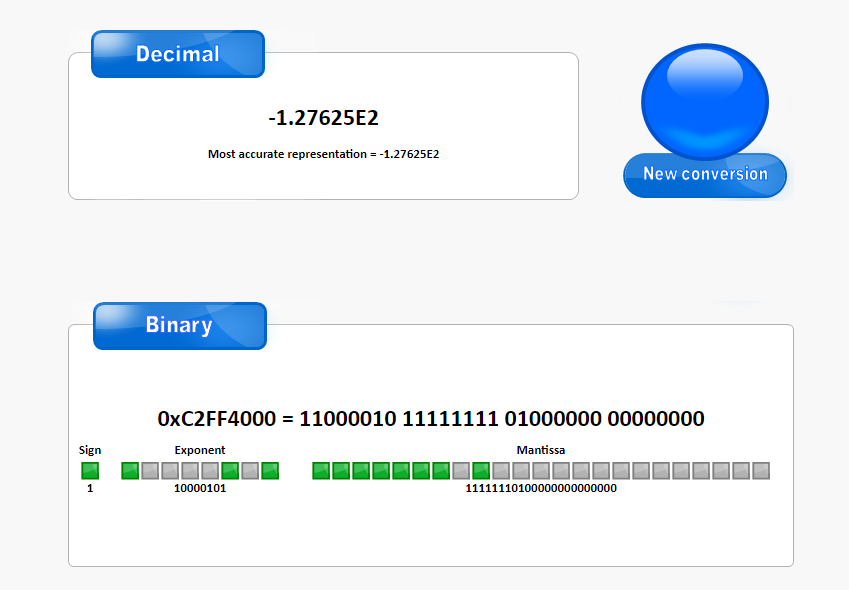
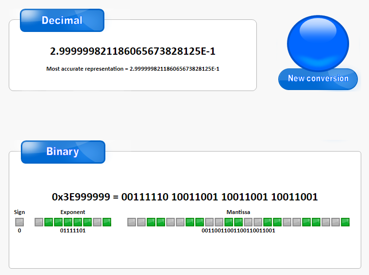
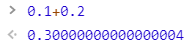

# IEEE 754(부동소수점 표기표준)  
> 전기 전자 기술자 협회(IEEE)에서 개발한 컴퓨터 부동소수점을 표현하는 가장 널리 쓰이는 표준이다.    
> +-0 , 무한, NaN(Not a Number) 등의 기호를 표시하는 법과 이러한 수에 대한 연산을 정의하고 있다.  
> IEEE 754에는 32 비트 단정도(Single-precision), 64비트 배정도(double-precision) 등등에 형식을 정의하고 있따.    
> 대부분의 언어에서 float는 단정도, double은 배정도와 대응된다.  

## 이슈!!!
> 미트박스 사이트내 계근정산시 일반 구매에 경우   
> - ((최대중량 * (kg당 가격 + 옵션1 + 옵션2 + 옵션3)) 소수점 올림) * 박스 수     
> 대량구매 경우   
> - ((최대중량 * kg당 가격 * 박스 수) 소수점 올림)     
> 반올림 과정에서 반올림이 안되는걸 식별.!  원인은 IEEE 754 부동소수점 표기표준 때문.  
> ex) Math.floor(반올림할 수 + 0.5) < 요런식으로 계산중이엿음.!! 상식적으론 당연히 0.5가 넘으면 반올림이 될거라 생각함.    
> 하지만 결과는 다름 아래와 같은 이유때문에.  

## 구조


1. 부호비트 : 0 일 경우 양수, 1일 경우 음수    
2. 지수부 : 기준값(Bias)를 기준 32비트 127, 64비트 1023    
ex) 32bit는 지수부 8비트(0111 1111), 64bit 는 지수부 11비트(011 1111 1111)    
3. 가수부 : 1.xxxxxx X 2^n 형태로 정규화된 부동수점을 만든 수에 왼쪽에 1을 제거하고 소수점 이하의 자리값.   

## 표현 과정.
* -127.625 (단정도)
1. 변환 하려는 수가 양수인지 음수인지 판별. 양수일 경우 부호비트 0, 음수일 경우 1   
    - 31번째 수는 1  
2. 해당 수에 절대 값을 2진수를 변환  
    - 1111111.101  
3. 소수점을 왼쪽으로 이동시켜, 왼쪽에는 1만 남게 한다.  
    - 1.111111101 X 2^6 (정규화된 부동소수점 수)  
4. 가수부는 소수점의 오른쪽 부분으로, 부족한 비트 수 부분만큼 0으로 채워 가수브를 채운다.   
    - 111 1111 0100 0000 0000  
5. 지수는 6이므로 Bias에서 더한다 .  
    - 127 + 6 = 133 -> 1000 0101  
6. 종합하면  
    - 1 | 1000 0101 | 111 1111 0100 0000 0000   
  
[참고 사이트](https://www.binaryconvert.com/result_float.html?hexadecimal=C2FF4000)  

## 그렇다면 이게 왜?? 문제를 일으킬까??  
> 0.1 + 0.2 를 해본 다면 ?? 자바스크립트로 대충 해보쟈.
1. 0.1을 계산하면  
    - 1. 0.5, 0.25, 0.125, 0.0625 계산해보면 소수점은 * 2를 연속으로 하면 된다. 
    - 2. 자바스크립트로 하면 "0.0001100110011001100110011001100110011001100110011001101" 요런 값이 나온다.
2. 0.2를 계산하면  
    - 1. 자바스크립트로 계산하면 "0.001100110011001100110011001100110011001100110011001101" 요런 값이 나온다
3. 0.1 + 0.2   
    0.0001100110011001100110011001100110011001100110011001101
   +0.001100110011001100110011001100110011001100110011001101
   ----------------------------------------------------------
    0.0100110011001100110011001100110011001100110011001100111
    - 1.00110011001100110011001100110011001100110011001100111 * 2^-2 (정규화된 부동소수점 수)
    - 0 | 0111 1101 | 001 1001 1001 1001 1001 
    

4. 자바스크립트 일때....
    
5. IF 
    - KG당 5450원에 최대중량 18.99 라면???
    * 곱하기/나누기는 더하기에 비해 조금 복잡하다.
        1. 지수를 같게 조정하지 않는다.
        2. 가수 끼리 (곱한다/나눈다).
        3. 지수끼리 (더한다/뺀다).
        4. 소수이하 자리는 정해진 자리에서 반올림 한다.
        5. 계산 결과 가수를 정규화한다.
    * 단순 계산 : 103495.5 , 그렇다면 IEEE 표준에 따른 결과는??

## 해결법.
```
> JAVA
BigDecimal을 사용하자.
BigDecimal maxKg = new BigDecimal(maxKgStr);
BigDecimal pricePerKg = new BigDecimal(orderItem.getPricePerKg());
BigDecimal opt1Price = new BigDecimal(orderItem.getOpt1Price());
BigDecimal opt2Price = new BigDecimal(orderItem.getOpt2Price());
BigDecimal opt3Price = new BigDecimal(orderItem.getOpt3Price());

boxAmt = maxKg.multiply(pricePerKg.add(opt1Price).add(opt2Price).add(opt3Price)).setScale(0, BigDecimal.ROUND_HALF_UP).longValueExact();
* 여기서 중요한건 소수점인 숫자는 String 이어야 한다!!! 

> Javascript 
0.2 + 0.7 = 0.8999999999999999
(0.2+0.7).toFixed(2) = 0.90
자릿수를 계산해서 잘라준다.!
```


