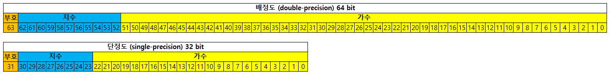

# IEEE 754(부동소수점 표기표준)  
> 전기 전자 기술자 협회(IEEE)에서 개발한 컴퓨터 부동소수점을 표현하는 가장 널리 쓰이는 표준이다.    
> +-0 , 무한, NaN(Not a Number) 등의 기호를 표시하는 법과 이러한 수에 대한 연산을 정의하고 있다.  
> IEEE 754에는 32 비트 단정도(Single-precision), 64비트 배정도(double-precision) 등등에 형식을 정의하고 있따.    
> 대부분의 언어에서 float는 단정도, double은 배정도와 대응된다.  

## 구조

1. 부호비트 : 0 일 경우 양수, 1일 경우 음수    
2. 지수부 : 기준값(Bias)를 기준 32비트 127, 64비트 1023    
ex) 32bit는 지수부 8비트(0111 1111), 64bit 는 지수부 11비트(011 1111 1111)    
3. 가수부 : 1.xxxxxx X 2^n 형태로 정규화된 부동수점을 만든 수에 왼쪽에 1을 제거하고 소수점 이하의 자리값.   