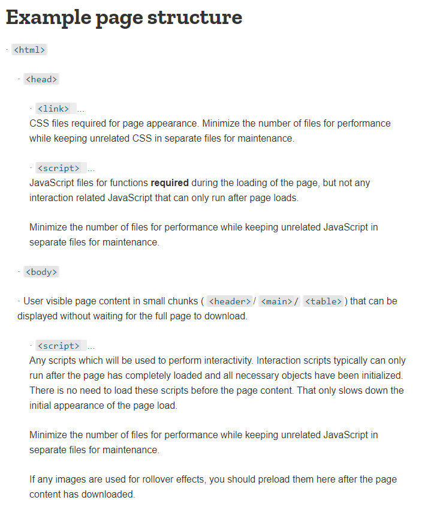

# Http vs Http2

<br>

## http
> 하나의 요청에 하나의 응답.  
> 순차적으로 이루어짐.
> DOM에 여러 리소스(image, css, script 등)가 있다면 리소스 개수에 비례해서 대기시간이 생김.

<br>

### http 단점.

#### 1. HOL (Head of line blocking)    

    > 한번에 한 파일밖에 못 보낸다. 그래서 특정 파일의 로딩이 늦어지면 다른 파일까지 줄줄이 느려지는 병목현상이 생기게 된다.   

<br>
<br>

    
    
    1. 스위치의 경우 input을 거쳐 switching fabric을 거쳐 output에 도달하게 된다.  
    2. 4번태 큐에서 1,3번이 같은 4번 아웃풋에 도달해야한다.  
    3. 둘중에 하나만 선택될수 있기에 1번을 우선으로 4번으로 보낸다면  
    4. 모든 파일이 영향을 받게 된다.


#### 2. Header  
> 쿠키와 중복된 헤더값이 매 요청 시 헤더에 포함되어 전송.  
> 전송하려는 값보다 헤더값이 큰경우도 존재

<br>

### http 단점 개선의 노력들.

#### 1. image sprite  


#### 2. domain sharding


#### 3. minify
#### 4. data uri scheme
 
```

```

#### 5. fast-loading html page


<br>
<br>
<hr>
<br>
<br>
  
## http2
> 2015년 IETF에 의해 공식적으로 발표된 HTTP/1.1의 차기 버전  
> http/1.1 의 핵심을 포함하고 있고 여러면으로 효율적으로 개선되었다.  

<br>

### http2 특징

<br>

#### 1. hol 개선  
    병렬로 처리할 수 있도록 개선.  
  
- 여러 요청을 하나도 차단하지 않고 병렬로 인터리빙할 수 있습니다.
- 여러 응답을 하나도 차단하지 않고 병렬로 인터리빙할 수 있습니다.
- 단일 연결을 사용하여 여러 요청과 응답을 병렬로 전달할 수 있습니다.
- 연결된 파일, 이미지 스프라이트(image sprites), 도메인 분할과 같은 불필요한 HTTP/1.x 임시 방편을 제거합니다.
- 불필요한 지연 시간을 제거하고 가용 네트워크 용량의 활용도를 개선하여 페이지 로드 시간을 줄입니다.

<br>

#### 2. 헤더 개선  
    HTTP/2 의 Header 필드는 Huffman code 로 인코딩되어 압축된다.  
    중복헤더의 경우 생략해버리는 식으로 처리속도를 높임.

- 전송되는 헤더 필드를 정적 Huffman 코드로 인코딩하도록 허용합니다. 이 코드는 필드의 개별 전송 크기를 줄여줍니다.
- 이전에 표시된 헤더 필드의 색인 목록을 클라이언트와 서버가 유지하고 업데이트하도록 요구합니다(즉, 공유 압축 컨텍스트(HPACK)를 구성합니다). 그런 다음, 이 목록을 참조로 사용하여 이전에 전송된 값을 효율적으로 인코딩할 수 있습니다.

<br>

#### 3. 서버 푸시  
    특정 파일을 서버에 지정해서 http 전송시 같이 밀어 넣는 방식.

- HTTP/2에 새로 추가된 또 다른 강력한 기능은 서버가 단일 클라이언트 요청에 대해 여러 응답을 보낼 수 있다
- 서버는 원래 요청에 응답할 뿐만 아니라 클라이언트가 명시적으로 요청하지 않아도 서버가 추가적인 리소스를 클라이언트에 푸시할 수 있다.

<br>

#### 4. 우선순위  
    파일의 우선순위를 둘 수 있다.  


- 각 스트림에는 1~256 사이의 정수 가중치가 할당될 수 있습니다.
- 각 스트림에는 다른 스트림에 대한 명시적 종속성이 부여될 수 있습니다.
- 참고: 스트림의 종속성과 가중치는 전송 기본 설정을 표현하는 것이지 요구사항을 표현하는 것은 아니므로, 특정한 처리나 전송 순서를 보장하지는 않습니다. 즉, 클라이언트는 스트림 우선순위 지정을 사용하여 특정 순서로 스트림을 처리하도록 서버에게 강요할 수 없습니다. 이것이 이상하게 보일 수도 있지만, 실제로는 바람직한 동작입니다. 우리는 우선순위가 높은 리소스가 차단된 경우 우선순위가 낮은 리소스에서 서버 진행이 차단되는 것을 원치 않습니다.

<br>

출처 
- google
- 나무위키
- 위키피디아
- https://developers.google.com/web/fundamentals/performance/http2
- https://kinsta.com/learn/what-is-http2/
- https://developer.mozilla.org