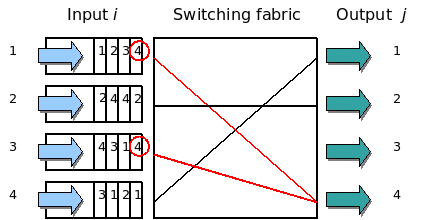

# Http vs Http2

 

## http
> 하나의 요청에 하나의 응답.  
> 순차적으로 이루어짐.
> DOM에 여러 리소스(image, css, script 등)가 있다면 리소스 개수에 비례해서 대기시간이 생김.

 

### http 단점.

1. HOL (Head of line blocking)  
    > 한번에 한 파일밖에 못 보낸다. 그래서 특정 파일의 로딩이 늦어지면 다른 파일까지 줄줄이 느려지는 병목현상이 생기게 된다.   

 
 

    
    
    1. 스위치의 경우 input을 거쳐 switching fabric을 거쳐 output에 도달하게 된다.  
    2. 4번태 큐에서 1,3번이 같은 4번 아웃풋에 도달해야한다.  
    3. 둘중에 하나만 선택될수 있기에 1번을 우선으로 4번으로 보낸다면  
    4. 모든 파일이 영향을 받게 된다.

2. Header  
> 쿠키와 중복된 헤더값이 매 요청 시 헤더에 포함되어 전송.  
> 전송하려는 값보다 헤더값이 큰경우도 존재
  
 
 

 
 
  
## http2
> 2015년 IETF에 의해 공식적으로 발표된 HTTP/1.1의 차기 버전  
> http/1.1 의 핵심을 포함하고 있고 여러면으로 효율적으로 개선되었다.  

 

### http2 개선점

1. hol 개선  
    병렬로 처리할 수 있도록 개선.

2. 헤더 개선  
    HTTP/2 의 Header 필드는 Huffman code 로 인코딩되어 압축된다.  
    중복헤더의 경우 생략해버리는 식으로 처리속도를 높임.

3. 서버 푸시
    특정 파일을 서버에 지정해서 http 전송시 같이 밀어 넣는 방식.

4. 우선순위
    파일의 우선순위를 둘 수 있다.
