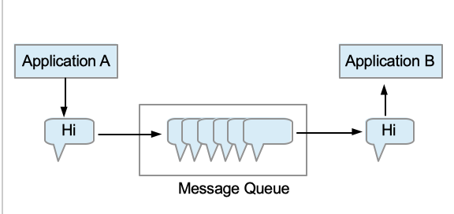
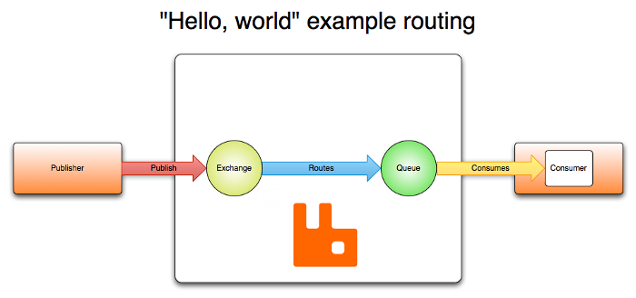

# Rabbit MQ

## MQ 란?
> MQ(Message Queue)란 메시지를 이용하여 여러 서비스들을 연결해주는 미들웨어 솔루션.  

### 장점
- 비동기 : Queue에 넣기 때문에 나중에 처리할 수 있습니다.
- 비동조 : Application과 분리할 수 있습니다.
- 탄력성 : 일부가 실패 시 전체는 영향을 받지 않습니다
- 과잉 : 실패할 경우 재실행이 가능합니다
- 확장성 : 다수의 프로세스들이 큐에 메시지를 보낼 수 있습니다.

 

## Rabbit MQ
> AMQP 를 구현한 오픈 소스 메시지 브로커 소프트웨어이며, STOMP, MQTT 및 기타 프로토콜을 지원한다.
> AMQP(Advanced Message Queuing Protocol)의 기능들은 메시지 지향, 큐잉, 라우팅(P2P 및 발행-구독), 신뢰성, 보안이다.

### 용어 정리
명칭 | 설명
---|---
Publisher(Producer) | 메시지를 생성하고 발송하는 주체.
Publish(Producing)  | 메시지를 전송하는 행위
Exchange            | Publisher(Producer)로 부터 수신한 메시지를 큐에 분배하는 라우터 역할
Routes              | 들어온 메시지를 Queue의 분배하는 행위
Queue               | 메시지를 메모리나 디스크에 저장했다가 Consumer에게 메시지를 전달 하는 역할
Binding             | Exchange와 Queue의 관계를 정의
Consumes(Subscribe) | Consumer가 Queue에 접근하여 메시지를 가져오는 행위.
Consumer            | 메시지를 가져오는 주체.

### Exchanges and Exchange Types
Exchange type | Default pre-declared names | 설명
---|---|---
Direct exchange     | (Empty string) and amq.direct
Fanout exchange     | amq.fanout
Topic exchange      | amq.topic
Headers exchange    | amq.match (and amq.headers in RabbitMQ)

### 출처 
- https://steady-snail.tistory.com/165
- https://www.rabbitmq.com/tutorials/amqp-concepts.html